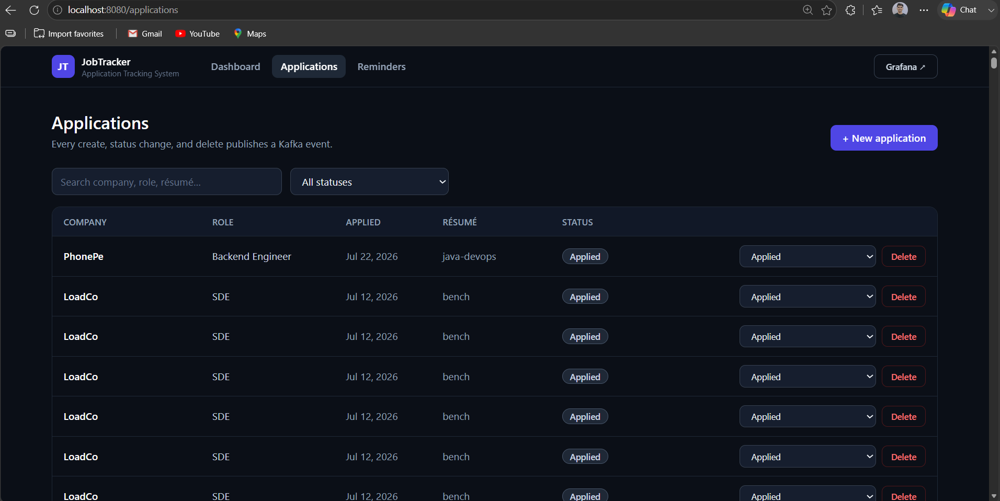
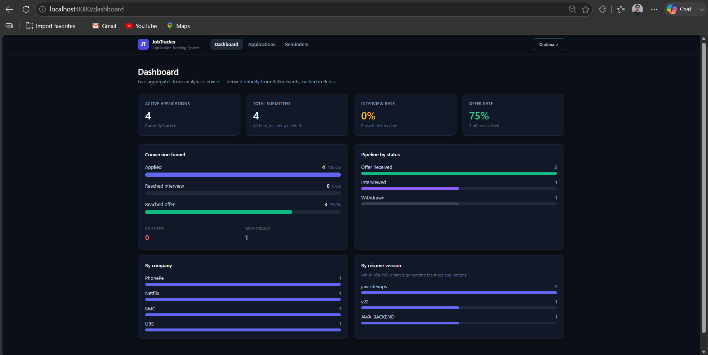
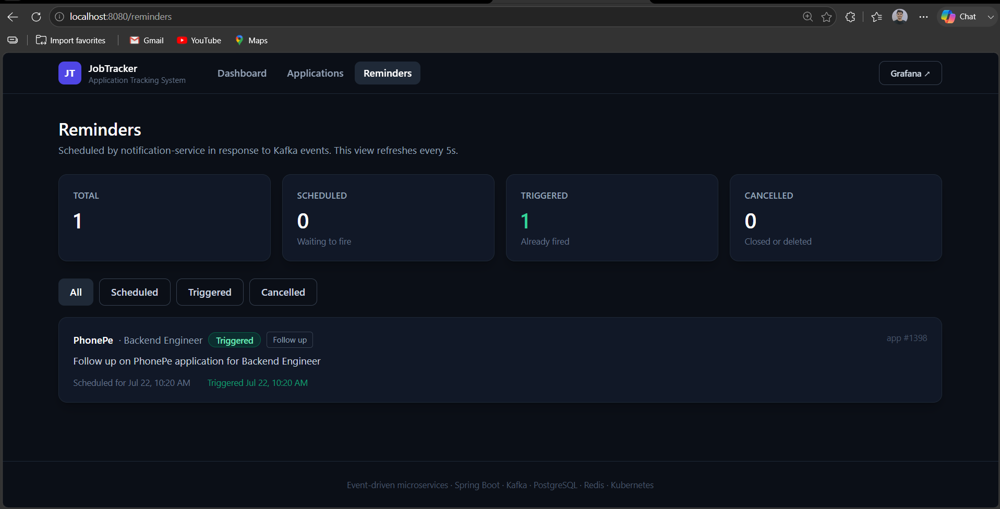
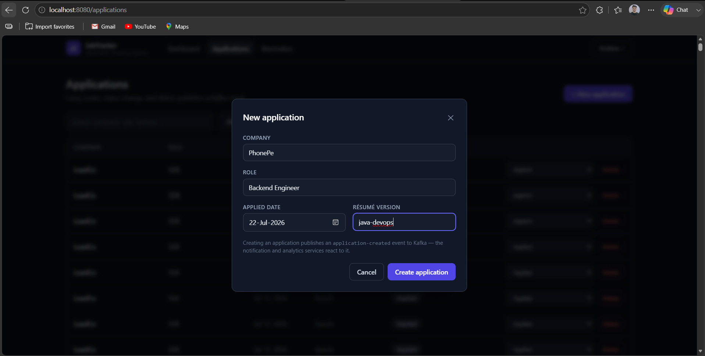
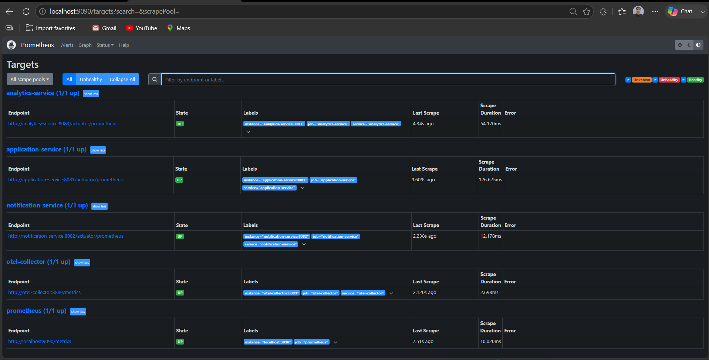
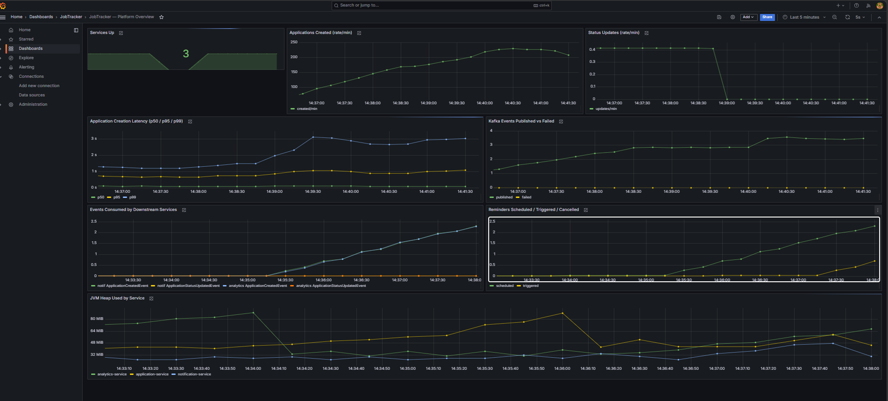

<div align="center">

# 🎯 Job Application Tracker

### Cloud-Native, Event-Driven Application Tracking System

A full-stack job application tracker built as a **production-grade microservices platform** —
event-driven backend, full observability, Kubernetes deployment, and GitOps delivery.

[](https://openjdk.org/)
[](https://spring.io/)
[](https://kafka.apache.org/)
[](https://react.dev/)


[](https://www.postgresql.org/)
[](https://redis.io/)
[](https://www.docker.com/)
[](https://kubernetes.io/)
[](https://www.terraform.io/)
[](https://grafana.com/)

[](https://github.com/vishal-kesharwani/JOB-APPLICATION-TRACKER/actions/workflows/ci.yml)

</div>

---



## What it is

Most job trackers are a CRUD app over one database. This one is deliberately built the way a
real distributed system is built: **three independent services that never call each other**.
They communicate purely through Kafka events.

When you create or update an application, `application-service` writes to PostgreSQL and
publishes an event. Two downstream services react on their own — one schedules reminders,
the other maintains an analytics read-model in Redis. Every request is traced end-to-end,
every service emits metrics, and the whole platform ships to Kubernetes via GitOps.

> **Design principle:** `application-service` is the single source of truth and the only
> writer to PostgreSQL (database-per-service). Consumers never touch that database — they
> react to events, and their state can be rebuilt at any time by replaying Kafka.

## ✨ Features

- **Full application lifecycle** — create, track, and move applications through 7 statuses (Applied → OA → Interview → Offer / Rejected / Withdrawn)
- **Automatic reminders** — follow-ups, interview prep, and offer nudges scheduled reactively, and cancelled automatically when an application closes
- **Live analytics** — conversion funnel with interview/offer rates, plus breakdowns by status, company, and résumé version
- **Full observability** — metrics, logs, and distributed traces across all three services in Grafana
- **Production deployment** — Kubernetes manifests with autoscaling, Terraform-provisioned EKS, CI/CD, and ArgoCD GitOps
- **Resilience proven** — chaos and load scripts demonstrating self-healing and HPA scale-out

## 🖼️ Screenshots

<table>
  <tr>
    <td width="50%"><br/><em>Dashboard — conversion funnel and live aggregates from Redis</em></td>
    <td width="50%"><br/><em>Reminders — scheduled reactively by notification-service</em></td>
  </tr>
  <tr>
    <td width="50%"><br/><em>Creating an application publishes a Kafka event</em></td>
    <td width="50%"><br/><em>All services scraped by Prometheus</em></td>
  </tr>
</table>


<div align="center"><em>Grafana — business metrics, latency percentiles, Kafka throughput, and JVM health</em></div>

## 🏗️ Architecture

```
                          ┌──────────────┐
                          │   React UI   │  :8080  (nginx serves + reverse-proxies /api)
                          └──────┬───────┘
                                 │ REST
                    ┌────────────▼─────────────┐
                    │   application-service    │  :8081
                    │  (owns PostgreSQL —      │
                    │   the only writer)       │
                    └────────────┬─────────────┘
                                 │ publishes
              ┌──────────────────▼───────────────────┐
              │              Kafka topics            │
              │  application-created                 │
              │  application-status-updated          │
              │  application-deleted                 │
              └────────┬────────────────────┬────────┘
                       │ consume            │ consume
          ┌────────────▼─────────┐  ┌───────▼──────────────┐
          │ notification-service │  │  analytics-service   │
          │  reminder scheduler  │  │  Redis read-model    │
          │        :8082         │  │        :8083         │
          └──────────────────────┘  └──────────────────────┘

   Observability:  services ──OTLP──► OTel Collector ──► Tempo (traces)
                   Prometheus ──scrape──► /actuator/prometheus  ──► Grafana
                   container logs ──Promtail──► Loki (logs)

   Delivery:  GitHub Actions ──► GHCR images ──► ArgoCD ──► AWS EKS (Terraform)
```

A rendered diagram lives in [`docs/architecture.mermaid`](docs/architecture.mermaid).

## 🧩 Services

| Service | Responsibility | Data store | Port |
|---|---|---|---|
| `frontend` | React UI — manage applications, view reminders and analytics | — | 8080 |
| `application-service` | CRUD for applications, publishes Kafka events | PostgreSQL | 8081 |
| `notification-service` | Consumes events, schedules follow-up/interview/offer reminders | In-memory scheduler | 8082 |
| `analytics-service` | Consumes events, maintains aggregates, serves reporting API | Redis | 8083 |

## 🛠️ Tech Stack

**Backend** — Java 21, Spring Boot 3.3, Spring Kafka, Spring Data JPA, Flyway
**Frontend** — React 18, Vite, Tailwind CSS, React Router, nginx
**Data** — PostgreSQL 18, Redis 7, Apache Kafka
**Observability** — OpenTelemetry, Micrometer, Prometheus, Grafana, Loki, Tempo
**Platform** — Docker, Kubernetes, Kustomize, Terraform, AWS EKS, GitHub Actions, ArgoCD

## 🚀 Quick Start

Only **Docker Desktop** is required — the builds compile everything in containers.

```bash
git clone https://github.com/vishal-kesharwani/JOB-APPLICATION-TRACKER.git
cd JOB-APPLICATION-TRACKER

# App + full observability stack
docker compose -f docker-compose.yml -f docker-compose.observability.yml up --build
```

First run takes a few minutes. Then open:

| What | URL | Login |
|---|---|---|
| **Web UI** | http://localhost:8080 | — |
| **Grafana** | http://localhost:3000 | admin / admin |
| Prometheus | http://localhost:9090 | — |
| Tempo | http://localhost:3200 | — |

Want to see the whole pipeline fire at once?

```bash
./scripts/demo.sh        # creates applications, drives statuses, prints results
./scripts/load-test.sh   # sustained load — watch the Grafana charts move
```

📖 Full setup guide, including Kubernetes and AWS: **[docs/RUNBOOK.md](docs/RUNBOOK.md)**

## 📡 API Reference

### application-service

| Method | Endpoint | Description |
|---|---|---|
| `POST` | `/api/v1/applications` | Create a new application |
| `GET` | `/api/v1/applications` | List all (optional `?status=` filter) |
| `GET` | `/api/v1/applications/{id}` | Get a single application |
| `PATCH` | `/api/v1/applications/{id}/status` | Update status — `{"status":"INTERVIEW_SCHEDULED"}` |
| `DELETE` | `/api/v1/applications/{id}` | Delete an application |

### analytics-service (read-only)

| Method | Endpoint | Description |
|---|---|---|
| `GET` | `/api/v1/analytics/summary` | Totals, status breakdown, funnel + conversion rates |
| `GET` | `/api/v1/analytics/by-status` | Live count per status |
| `GET` | `/api/v1/analytics/by-company` | Applications per company |
| `GET` | `/api/v1/analytics/by-resume` | Applications per résumé version |
| `GET` | `/api/v1/analytics/funnel` | Historical funnel (created → interview → offer) |

### notification-service

| Method | Endpoint | Description |
|---|---|---|
| `GET` | `/api/v1/reminders` | All scheduled/triggered/cancelled reminders |
| `GET` | `/api/v1/reminders/summary` | Reminder counts by state |

All services expose `/actuator/health/{liveness,readiness}` and `/actuator/prometheus`.

## 📊 Custom Metrics

Business metrics, not just JVM defaults:

- `job_applications_total` · `job_status_updates_total`
- `application_creation_latency` — histogram with p50/p95/p99
- `kafka_events_published_total` · `kafka_events_publish_failed_total`
- `notification_events_consumed_total` · `reminders_scheduled_total` · `reminders_triggered_total`
- `analytics_events_consumed_total` · `analytics_aggregation_errors_total`

## ☸️ Kubernetes

Kustomize base with `local` (Kind) and `prod` (EKS) overlays — deployments, probes, HPA,
ConfigMaps/Secrets, and an ALB Ingress.

```bash
kind create cluster --config infrastructure/kubernetes/overlays/local/kind-cluster.yaml
for s in application-service notification-service analytics-service frontend; do
  docker build -t $s:latest ./$s && kind load docker-image $s:latest --name jobtracker
done
kubectl apply -k infrastructure/kubernetes/overlays/local

./scripts/chaos.sh       # kill a pod → watch Kubernetes reschedule it
./scripts/load-test.sh   # drive load → watch the HPA scale out
```

## ☁️ Cloud & CI/CD

- **Terraform** provisions a 3-AZ VPC, EKS cluster, managed node groups, and IRSA — see [`infrastructure/terraform/README.md`](infrastructure/terraform/README.md) (⚠️ billable; always `terraform destroy`).
- **GitHub Actions** builds and tests all services on every push, then publishes images to GHCR.
- **ArgoCD** watches the prod overlay and reconciles the cluster — see [`infrastructure/argocd/README.md`](infrastructure/argocd/README.md).

## 🗺️ Roadmap

- [x] `application-service` — CRUD + PostgreSQL + Kafka producer
- [x] `notification-service` — Kafka consumer + reminder scheduling
- [x] `analytics-service` — Kafka consumer + Redis aggregates + reporting API
- [x] React UI with nginx reverse proxy
- [x] OpenTelemetry + Prometheus + Loki + Tempo + Grafana dashboards
- [x] Kubernetes manifests (Kustomize, Kind + prod overlays) with HPA
- [x] Terraform (EKS, VPC, IAM/IRSA)
- [x] GitHub Actions CI/CD + ArgoCD GitOps
- [x] Chaos + load test scripts
- [ ] Canary deployments with Argo Rollouts
- [ ] Authentication (OIDC) and multi-user support

## 📄 License

Open source under the [MIT License](LICENSE).

---

<div align="center">

**Vishal Kesarwani**

[](https://vishalkesarwani.in)
[](https://github.com/vishal-kesharwani)
[](https://linkedin.com/in/vishal-kesharwani02)

⭐ If you found this useful, consider starring the repo

</div>
